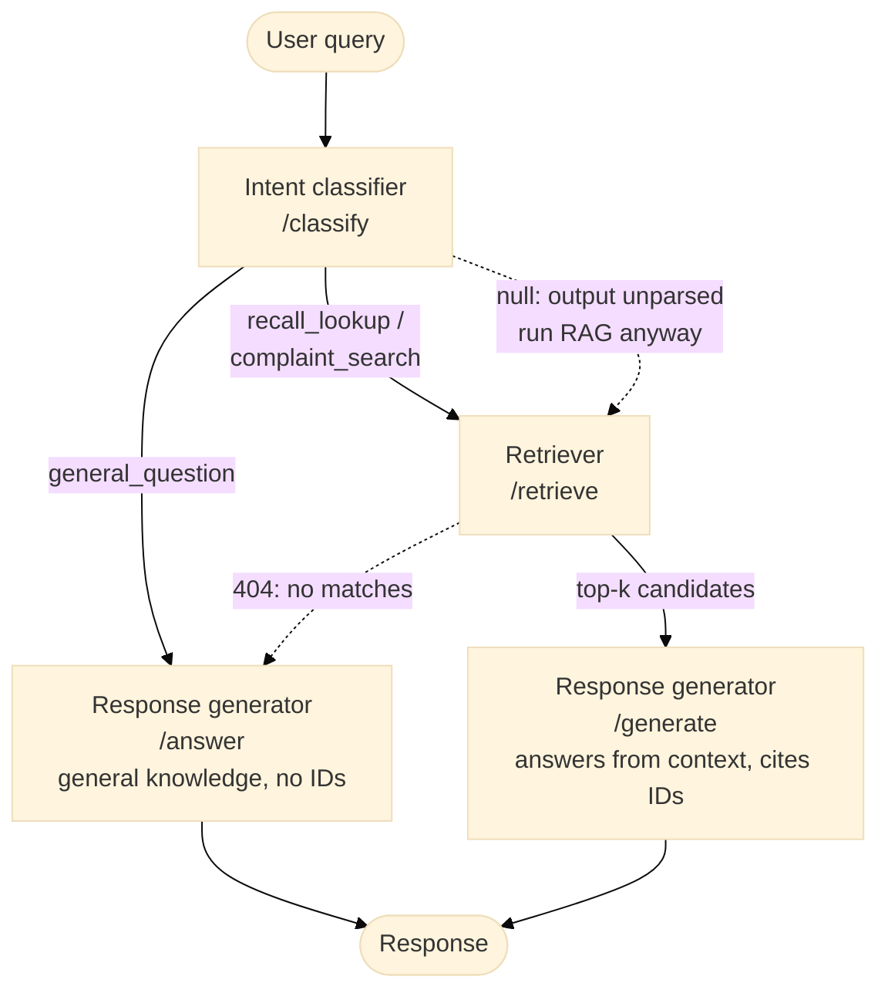

# Auto Safety Assist

Ask a plain-English question about your car's safety and get an answer backed by official records, with the recall or complaint number it came from.

The answers come from [NHTSA](https://www.nhtsa.gov/) (the US National Highway Traffic Safety Administration), which publishes two kinds of public records:

- **Recalls**: defects a manufacturer has officially acknowledged and will fix for free
- **Complaints**: problems reported by owners, which may or may not lead to a recall

### What you can ask

| You ask | What it does | Example answer (shortened) |
|---|---|---|
| *"Is there a recall on my 2018 BMW X5 for the charging cable catching fire?"* | Looks up **recalls** | Yes, for the plug-in hybrid X5 xDrive40e. **Recall 18V652000**: capacitors in the portable charger may fail, creating a shock or fire hazard. Dealers will replace it free of charge. |
| *"My Camry's wipers turn on by themselves. Has anyone else reported this?"* | Searches owner **complaints** | Yes. **Complaint 11744296** reports a Toyota Camry whose wipers turn on by themselves; the dealer couldn't find a problem. |
| *"How do car recalls work in general?"* | Answers from general knowledge, with no retrieval | A general explanation, with no recall or complaint numbers, since none were looked up |

Every record-based answer cites its source, so you can check it on nhtsa.gov instead of trusting the model. If no matching record is found, it falls back to a general answer and never makes up a record number.

**Coverage:** Its a project in progress, so it currently covers three vehicles: the 2018 BMW X5, the 2022 Toyota Camry and the 2022 Honda CR-V ([`TARGET_VEHICLES`](src/common/config.py)).

Under the hood, it's a retrieval-augmented generation (RAG) pipeline: it classifies the question, finds the most relevant records with vector search, then has an LLM write an answer using only those records.

## Architecture

Microservices, each independently deployable:

- **ingestion** — batch job that pulls NHTSA recall/complaint data ([nhtsa.gov](https://www.nhtsa.gov/), see [NHTSA datasets and APIs](https://www.nhtsa.gov/nhtsa-datasets-and-apis)), chunks it, embeds it, and loads it into Postgres.
- **intent-classifier** — FastAPI service that classifies whether a query needs the RAG pipeline or is a general question.
- **retriever** — FastAPI service that performs vector similarity search over embedded NHTSA data (pgvector).
- **response-generator** — FastAPI service that builds context from retrieved records and generates a cited LLM response (`/generate`), or answers from general knowledge when there are no records (`/answer`).
- **pipeline** — thin orchestrator that calls the services in sequence: ingest → classify intent → retrieve → generate, routing to `/answer` when no retrieval is needed.

### Request flow



Dashed arrows are fallbacks. If the classifier can't parse the model's output, the query still goes through retrieval. If retrieval finds no matching records, the query is answered from general knowledge without citing recall or complaint IDs. Source: [docs/diagrams/pipeline-flow.mmd](docs/diagrams/pipeline-flow.mmd).

## Tech Stack

| Layer | Tools | Used for |
|---|---|---|
| **AI / RAG** | OpenAI API (`gpt-4o-mini` by default) | Classifying the question and writing the cited answer |
| | `sentence-transformers` (`all-MiniLM-L6-v2`, CPU) | Turning recall and complaint text into vectors |
| **Data** | PostgreSQL + `pgvector` | Storing the vectors and finding the closest matches |
| | pandas, psycopg2 | Cleaning NHTSA data and talking to Postgres |
| **Services** | Python 3.11+, FastAPI + Uvicorn | The three HTTP services |
| | loguru | Logging |
| **Quality** | pytest, ruff | Tests and linting |
| | RAGAS | Scoring answer quality with an LLM judge (see [evals/](evals/README.md)) |
| **Packaging** | `uv` + `pyproject.toml` | Dependencies and virtual environments |
| | Docker + Docker Compose | One image per service; `docker compose up` runs the whole stack locally |
| **CI/CD** | GitHub Actions | Lint, test and build images on every change; quality gate on PRs to `main` (see [docs/ci_workflows.md](docs/ci_workflows.md)) |
| **AWS** | ECR (+ GHCR for now) | Container images, pushed from `main` |
| | RDS for PostgreSQL 18 + `pgvector` | Managed cloud database holding the embedded recalls and complaints |
| | Secrets Manager | RDS password, generated and stored by RDS; fetched when needed |
| | S3 | Pinned eval data snapshot used for CI Quality gate |
| | IAM + GitHub OIDC | CI logs in to AWS with short-lived credentials, no stored keys (policies in [infra/aws/iam/](infra/aws/iam/)) |

<!-- Deployment to AWS (ECS Fargate + ALB) is in progress. See [docs/aws-services.md](docs/aws-services.md) for the plan. -->

## Running Locally

Requires Docker + Docker Compose, and a `.env` file at the repo root with your Postgres and OpenAI credentials (`POSTGRES_USER`, `POSTGRES_PASSWORD`, `DATABASE_NAME`, `OPENAI_API_KEY`, etc. — see `src/common/config.py` for the full list of env vars each service reads).

### 1. Ingest data

Pulls recall/complaint data from NHTSA, embeds it, and loads it into Postgres. The `ingestion` service is compose-profiled so it doesn't run on every `up` — invoke it explicitly as a one-off job:

```bash
docker compose --profile jobs run --rm ingestion
```

This starts Postgres (if not already running) and runs the ingestion + indexing pipeline once, then exits.

### 2. Run the services

```bash
docker compose up
```

Starts Postgres and the three FastAPI services:

| Service | Port | Docs |
|---|---|---|
| intent-classifier | 8000 | http://localhost:8000/docs |
| retriever | 8001 | http://localhost:8001/docs |
| response-generator | 8002 | http://localhost:8002/docs |

Each service exposes a `/healthz` endpoint you can hit to confirm it's up, and interactive Swagger docs at `/docs`.
