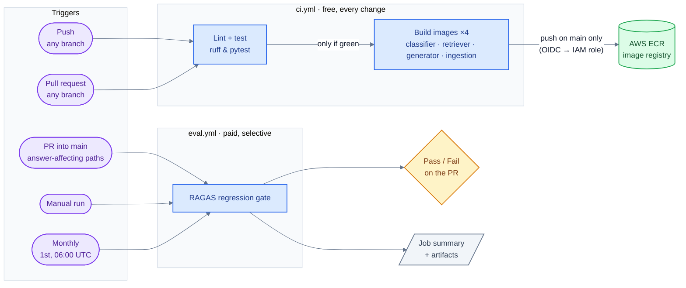
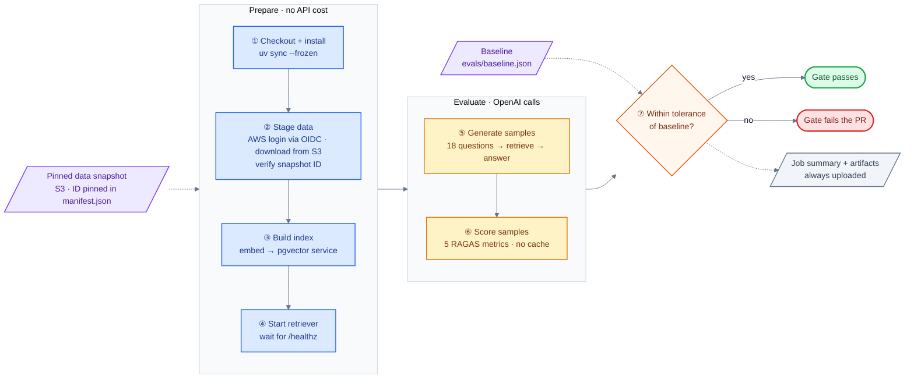

# CI workflows

The repo has two GitHub Actions workflows with different jobs and costs:

| Workflow | Runs when | Cost | Purpose |
|---|---|---|---|
| [`ci.yml`](../.github/workflows/ci.yml) | Every push and pull request | Free | Lint, test, and build the service images |
| [`eval.yml`](../.github/workflows/eval.yml) | PRs into `main` that touch answer-affecting code, manual runs, monthly | Paid (OpenAI) | Block changes that make answers worse |

## Overview

- **`ci.yml`** runs on every change because it's fast and free. Images are built on every run (to catch broken Dockerfiles) but only pushed to ECR from `main`, tagged with the commit SHA. CI logs in to AWS with GitHub OIDC, using a role that only `main` can assume and that can push images but not delete them.
- **`eval.yml`** calls OpenAI, so it only runs when answer quality can change: PRs into `main` that touch the retriever, generator, shared config, ingestion, evals or dependencies. The monthly run catches model drift, where a model changes behind an unchanged name.

## Eval regression gate

**Prepare** builds a throwaway copy of the system inside the runner. Postgres runs as a service container that only lives for this job. The data comes from the pinned snapshot, never the live NHTSA API, and the job stops if its ID doesn't match the manifest.

The snapshot files live in S3, one folder per snapshot ID. The job logs in to AWS with GitHub OIDC: GitHub issues a short-lived token, and AWS swaps it for temporary credentials for a role that only this repo can assume and that can only read the snapshot folder. No AWS keys are stored in GitHub. The role ARN and bucket name are repository variables (`AWS_EVAL_ROLE_ARN`, `EVAL_SNAPSHOT_BUCKET`). The IAM policies are in [`infra/aws/iam/`](../infra/aws/iam/), and the steps for publishing a new snapshot are in [evals/README.md](../evals/README.md#refreshing-the-snapshot).

**Evaluate** generates fresh answers for the 18 retrieval questions in the golden dataset and scores them with RAGAS. The judge cache is off, because the baseline's tolerances were measured without it.

**The gate** (`compare_ragas check`) fails the job when:

| Check | Why |
|---|---|
| A gated metric drops more than its tolerance below the baseline | A real quality regression |
| Any judge call failed | The mean is computed on fewer samples and can't be trusted |
| The judge model, embedding model, metric mode or RAGAS version differs from the baseline | Scores from a different measuring setup aren't comparable |
| The data snapshot differs from the baseline | The golden labels may no longer match the data; rebuild the baseline instead |

Faithfulness, factual correctness, context precision and context recall are gated. Answer relevancy is reported but never fails the gate, because it moves with answer style rather than quality.

The job summary and the samples/scores artifacts are uploaded even when the gate fails, since that's when they're needed.
