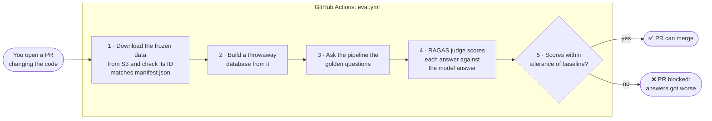
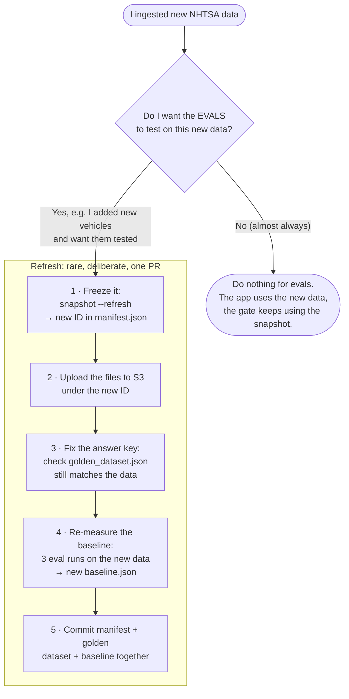

# Evals and the CI Quality Gate

How this project checks that a code change didn't make the answers worse, and what to do when the data changes.

For command-level detail, see [evals/README.md](../evals/README.md) and [ci_workflows.md](ci_workflows.md).

---

## The key idea: two separate copies of the data

| | **App data** | **Eval data (the snapshot)** |
|---|---|---|
| What it's for | Answering real users | Testing whether a code change made answers better or worse |
| Where it lives | The database (local Docker or RDS) | S3, pinned by [`manifest.json`](../evals/fixtures/nhtsa_snapshot/manifest.json) |
| How often it changes | Whenever you re-ingest | **Almost never**, and only on purpose |

**Re-ingesting new data does not affect the evals.** You can refresh the app's data as often as you like. The quality gate keeps testing against its frozen copy.

---

## How the eval works: think of a school exam

| Exam | This project | File |
|---|---|---|
| **Textbook** (frozen, everyone studies the same edition) | The **snapshot** of NHTSA data | S3, ID in [`manifest.json`](../evals/fixtures/nhtsa_snapshot/manifest.json) |
| **Exam questions + model answers** | The **golden dataset**: questions, each with a hand-written ideal answer | [`golden_dataset.json`](../evals/golden_dataset.json) |
| **The student** | The pipeline (retriever + response generator) | [`src/`](../src/) |
| **The examiner** | **RAGAS**, an LLM judge that compares the pipeline's answers with the model answers | [`eval_ragas.py`](../evals/eval_ragas.py) |
| **Last term's grade, ± the examiner's mood** | The **baseline**: average scores, plus a tolerance for how much the judge varies from run to run | [`baseline.json`](../evals/baseline.json) |
| **"Did the grade drop more than the margin?"** | The **regression gate** | [`compare_ragas.py`](../evals/compare_ragas.py) `check` |

The exam is only fair if **the textbook, the questions and the examiner stay fixed**. Then if the grade drops, the cause must be **the student**, meaning the code change.

---

## What happens on every PR (automatic)



Nothing here is manual: change code, open a PR, and the gate reports whether answer quality held up. It only runs on PRs into `main` that touch answer-affecting code, plus a monthly run, because each run costs OpenAI calls.

---

## "I have new data, what do I do?"



### Why a refresh has so many steps

Changing the **textbook** means the old **answer key** and the old **grade** no longer apply:

- **Step 3:** a model answer might cite a recall that's no longer in the data, or miss a newer one. The answer key has to match the textbook.
- **Step 4:** the old baseline measured performance on the *old* data, so comparing new runs against it would be unfair. The gate **refuses** to compare runs from a different snapshot ([compare_ragas.py:141](../evals/compare_ragas.py#L141)), which stops you forgetting this step.
- **Step 5:** all three files describe the same exam, so they change together.

Exact commands for steps 1–2 are in [evals/README.md: Refreshing the snapshot](../evals/README.md#refreshing-the-snapshot). Step 4:

```powershell
# repeat 3 times (each run: fresh answers, scored without cache)
uv run python -m evals.generate_ragas_samples
uv run --group eval python -m evals.eval_ragas --no-cache

# combine the 3 score files into a new baseline
uv run python -m evals.compare_ragas baseline evals/results/ragas_scores_<a>.json <b>.json <c>.json
```

**Why 3 runs:** the judge is an LLM, so it scores the *same* answers slightly differently each time. Three runs measure how big that wobble is, and that becomes each metric's tolerance: at least 0.03, or twice the measured variation if that's bigger. The gate then fails only on real drops, not on noise.

---

## Quick reference: "what do I do when…"

| Situation | What to do |
|---|---|
| I changed a prompt, the retriever or the code | Open a PR. The gate runs by itself. |
| The gate failed | Open the job summary and see which metric dropped. Fix the code, or accept that the change made answers worse. |
| I ingested fresh data for the app | **Nothing** for evals |
| I want the evals to cover new data or vehicles | Full refresh (steps 1–5) |
| I edited questions or answers in the golden dataset | Steps 4–5 only (re-measure the baseline) |
| I changed the judge model or upgraded RAGAS | Steps 4–5 only, because the examiner changed |
| I ran evals **locally** after re-ingesting, and the snapshot check failed | Expected: local `data/` is newer than the snapshot. This is the safety net working. |

---

## In short

The RAG pipeline has a quality gate in CI. A frozen, versioned snapshot of the source data is kept in S3, and a golden set of questions with reference answers. On every PR that touches answer-related code, CI rebuilds the index from that snapshot, runs the golden questions through the pipeline, and uses RAGAS, an LLM judge, to score faithfulness, factual correctness and retrieval quality. The scores are compared with a baseline. Because the LLM judge is noisy, we measure its run-to-run variation and set each metric's tolerance from that, so the gate only fails on real regressions, not on noise. Freezing the data means any drop in score comes from the code change, not from new data. Refreshing the snapshot is a deliberate step that also requires re-checking the reference answers and re-measuring the baseline.
