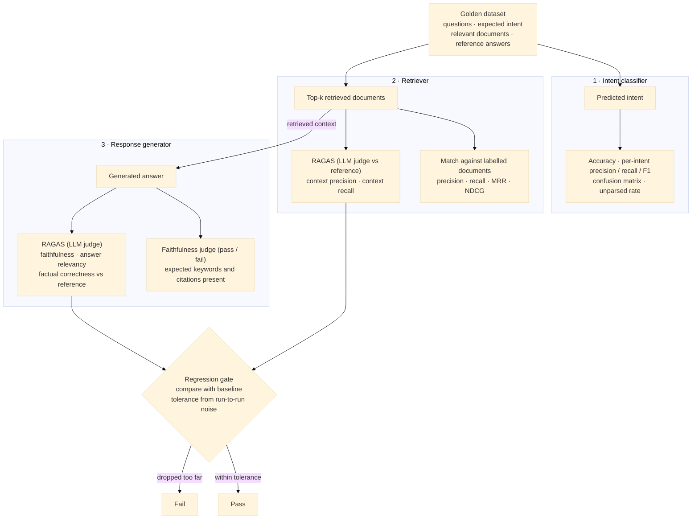

# Evaluations

The evals in this folder score each pipeline stage against the hand-labeled examples in `golden_dataset.json`.

| Script | Stage | Needs |
|---|---|---|
| `eval_intent_classifier.py` | Intent classifier | `OPENAI_API_KEY` |
| `eval_retriever.py` | Retriever | Postgres and the retriever service running |
| `eval_response_generator.py` | Response generator | Postgres, the retriever service and `OPENAI_API_KEY` |
| `generate_ragas_samples.py` | Retriever + response generator | Postgres, the retriever service and `OPENAI_API_KEY` |
| `eval_ragas.py` | Retriever + response generator | `OPENAI_API_KEY` and the `eval` dependency group |
| `compare_ragas.py` | Regression gate for RAGAS scores | Saved RAGAS score files |

There are two kinds of evals:

- **Label-based evals** (`eval_intent_classifier.py`, `eval_retriever.py`, `eval_response_generator.py`) compare outputs with exact labels: intents, document keys and expected keywords. They are fast, cheap and easy to reason about.
- **RAGAS evals** (`generate_ragas_samples.py`, `eval_ragas.py`, `compare_ragas.py`) use an LLM judge to compare retrieved text and answers with a hand-written reference answer. They measure meaning, so they give credit for a relevant document that isn't labeled and catch an answer that is faithful to its context but wrong.

Run both. Where they disagree is usually the most useful signal. See [Label-based vs. RAGAS](#label-based-vs-ragas).



## Golden dataset

Every example has the fields all evals use, plus fields for specific stages:

```json
{
  "id": "GD-001",
  "query": "...",
  "intent": "recall_lookup",
  "vehicle_tag": "bmw_x5_2018",
  "relevant": [
    { "source": "recall", "key": "18V652000", "grade": 2 }
  ],
  "gold_answer_contains": ["18V652", "charging cable"],
  "reference_answer": "Yes, for the plug-in hybrid X5 xDrive40e. Recall 18V652000 covers ..."
}
```

- `intent` is the gold label for the intent classifier: `recall_lookup`, `complaint_search` or `general_question`.
- `relevant` is the gold label for the retriever. See [Retriever](#retriever).
- `gold_answer_contains` lists strings the generated answer must contain, such as citation numbers and key terms. See [Response generator](#response-generator).
- `reference_answer` is a short, hand-written ideal answer, based only on the relevant recall and complaint text. The RAGAS judge compares retrieved context and generated answers against it. See [RAGAS](#ragas).

General questions have an empty `relevant` and `gold_answer_contains` and a null `reference_answer`, because the pipeline answers them without retrieval. Only the intent classifier eval uses them.

# Intent classifier

`eval_intent_classifier.py` sends every query in `golden_dataset.json` to the classifier and compares the predicted intent with the gold `intent` label.

```bash
uv run python -m evals.eval_intent_classifier
```

The script doesn't need a running service. It calls the classifier's FastAPI app in-process through `TestClient`, so the request goes through the same validation and `/classify` endpoint as in production. It calls the real OpenAI model, so `OPENAI_API_KEY` must be set (it is loaded from `.env`), and each run costs a little money. Set `OPENAI_MODEL` to evaluate a different model.

Unlike the retriever eval, this eval uses every example, including general questions.

## Metrics

| Metric | Question it answers | How it's computed |
|---|---|---|
| Accuracy | How many queries got the right intent? | correct predictions / all queries |
| Precision (per intent) | When we predict this intent, how often are we right? | TP / (TP + FP) |
| Recall (per intent) | Of the queries with this intent, how many did we catch? | TP / (TP + FN) |
| F1 (per intent) | One number that balances precision and recall | 2 · P · R / (P + R) |
| Support | How many gold examples does this intent have? | TP + FN |


### Why per-intent metrics matter

Accuracy alone hides which intents are being confused. The dataset is small and a bit imbalanced (9 recall, 9 complaint, 6 general), so one wrong prediction moves the metrics a lot: about 4 points of accuracy, and more for per-intent recall on `general_question`.

The costs of the errors are also different. In `src/pipeline.py`, a `general_question` prediction skips retrieval and is answered by the response generator's `/answer` endpoint, which uses general knowledge only:

- Predicting `general_question` for a recall or complaint query is the worst mistake: the user gets a generic answer that tells them no records were found, even though the database may have them.
- Predicting `recall_lookup` or `complaint_search` for a general question runs retrieval for nothing. That is wasteful but mostly harmless: if nothing matches, the pipeline falls back to `/answer`, and if something does, the generator is told to say when the context doesn't answer the question.
- Mixing up `recall_lookup` and `complaint_search` doesn't change anything yet, because the retriever doesn't use the intent. It will matter once retrieval is routed by intent.

### Unparsed intents

If the model's output can't be parsed (for example, it refuses or the output is cut off), the classifier returns `"intent": null` instead of guessing. The pipeline then runs RAG anyway, because a wasted retrieval costs less than answering a recall question without data.

The eval reports these as `unparsed`: they get their own count and confusion-matrix column, count as wrong for accuracy, and lower the recall of the gold intent. They don't count as a false positive for any intent, so they can't hide inside another intent's precision.

## Reading the report

```
Accuracy: 22/24 (91.7%)
Unparsed: 0/24

intent               precision    recall        f1   support
recall_lookup             1.00      0.89      0.94         9
complaint_search          0.90      1.00      0.95         9
general_question          0.83      0.83      0.83         6

Confusion matrix (rows = gold, cols = predicted):
                           recall_lookup    complaint_search    general_question            unparsed
recall_lookup                          8                   0                   1                   0
complaint_search                       0                   9                   0                   0
general_question                       0                   1                   5                   0

Mispredictions (2):
  [GD-007] gold=recall_lookup pred=general_question | ...
  [GD-019] gold=general_question pred=complaint_search | ...
```

The numbers above are only an example of the format.

- **Rows are gold, columns are predicted.** Read along a row to see where queries of one intent went. Read down a column to see what was predicted as that intent.
- **Start debugging with the mispredictions list.** Often the query is genuinely ambiguous. If so, change the label or the classifier instructions (`CLASSIFIER_INSTRUCTIONS` in `src/common/config.py`), not the model.
- **Run it more than once before comparing changes.** The model isn't fully deterministic, so a single prediction can flip between runs. With 24 examples, a difference of one or two queries may just be noise.
- An OpenAI error stops the run. The script raises on the first failed request and doesn't skip it.

# Retriever

`eval_retriever.py` sends every query in `golden_dataset.json` to the running retriever and scores the ranked results against hand-labeled relevant documents.

```bash
docker-compose up -d postgres retriever
uv run python -m evals.eval_retriever
```

## Golden labels

Each example lists the NHTSA documents that should come back for its query:

```json
{
  "query": "...",
  "relevant": [
    { "source": "recall", "key": "18V652000", "grade": 2 }
  ]
}
```

- `key` is the NHTSA natural key: the campaign number for recalls, the ODI number for complaints.
- `grade` is how relevant the document is. Recalls are graded 2 and complaints 1. Only NDCG uses the grade.
- Examples with an empty `relevant` list (general questions) are skipped.

The retriever returns Postgres row ids. Before scoring, the script maps them to NHTSA keys so they can be compared with the golden labels.

## Chunks vs. documents

Each recall is stored as three chunks: summary, remedy and consequence. All three have the same campaign number, so one recall can fill up to three of the top-k slots.

The golden labels are per document, not per chunk, so the metrics are computed per document too:

- **Precision** counts each document once. Repeated chunks are dropped, keeping the highest-ranked one.
- **MRR and NDCG** use the original chunk ranks, because that's the order the LLM sees. NDCG gives credit for a document only at its first occurrence.

## Metrics

| Metric | Question it answers | How it's computed |
|---|---|---|
| Precision@k | How much of what we returned is relevant? | relevant docs returned / unique docs returned |
| Recall@k | Did we find everything we needed? | relevant docs returned / relevant docs in golden set |
| MRR | How high is the first relevant result? | 1 / rank of the first relevant chunk, averaged over queries |
| NDCG@k | Is the whole ranking in a good order? | graded gain discounted by log2(rank + 1), divided by the score of a perfect ranking |
| Unique docs@k | How many of the k slots hold distinct documents? | unique docs / chunks returned |

### Precision ceiling

Most queries in the dataset have one relevant document. With k=5, the best possible precision for such a query is about 0.2. Even a perfect retriever would have non-relevant documents in the other four slots.

The report prints the ceiling next to precision:

```
Mean Precision@k: 0.21  (ceiling 0.25)
```

Compare precision with the ceiling, not with 1.0. Until the dataset has more queries with several relevant documents, use Recall, MRR and NDCG to compare retriever changes.

### Unique docs@k

A low value here means repeated chunks of the same recall are crowding other documents out of the top-k. Watch it when changing the chunking strategy or `top_k`.

## Reading the report

```
Evaluated 18 queries (top_k=5)

Mean Precision@k: 0.21
Mean Recall@k:    0.86
MRR:              0.71
Mean NDCG@k:      0.74
Mean unique docs@k: 4.6 / 5.0
```

- **Recall** matters most for RAG: the generator can't cite a document it never received.
- **MRR / NDCG** show whether relevant documents are near the top, which matters if `top_k` is reduced or a reranker is added.
- Queries with recall below 1.0 are listed after the summary with their golden, returned and deduplicated results. Start debugging with those.

# Response generator

`eval_response_generator.py` runs the real two-stage pipeline for every retrieval example: it retrieves over HTTP from the running retriever, then generates an answer. It scores each answer two ways.

```bash
docker-compose up -d postgres retriever
uv run python -m evals.eval_response_generator
```

The generator gets the retriever's real output as context, not a hand-picked golden context, so the eval tests what the generator actually sees in production. The generator itself is called in-process through `TestClient`, like the intent classifier eval.

## Metrics

| Metric | Question it answers | How it's computed |
|---|---|---|
| Faithfulness | Did the answer make anything up? | An LLM judge (`gpt-4o-mini`) reads the context and the answer and returns pass or fail, plus a list of unsupported claims |
| Gold keywords covered | Did the answer include the facts it must have? | Case-insensitive substring check for every string in `gold_answer_contains` |

The two catch different failures. Faithfulness catches **hallucination**: claims, numbers or citations that aren't in the context. The keyword check catches **incompleteness**: an answer that is faithful but leaves out the recall number or the component the user asked about.

If the retriever returns nothing, the example is recorded as unfaithful with every keyword missing.

## Reading the report

- **Unfaithful answers** are listed with the unsupported claims the judge found. Check them against the context before trusting the judge: it can be wrong too.
- **Missing keywords** can mean the answer is incomplete, or that it paraphrased (for example, "water pump" instead of "coolant pump"). The substring check can't tell these apart, so read the answer.
- Faithfulness is pass/fail, so one small slip counts the same as an invented answer. [RAGAS](#ragas) gives a graded score.

# RAGAS

The RAGAS evals score the retriever and the generator with [RAGAS](https://docs.ragas.io/) metrics. An LLM judge compares text with each example's `reference_answer` instead of matching document keys or keywords.

Install the extra dependencies once:

```bash
uv sync --group eval
```

## Generate once, score many times

Generating answers and scoring them are two separate steps:

1. **`generate_ragas_samples.py`** runs the real pipeline (retrieve, then generate) for every retrieval example and saves what the generator saw and said to `evals/results/ragas_samples_<timestamp>.json`. It also records the git commit, generator model and temperature, and `top_k`.
2. **`eval_ragas.py`** loads a samples file, scores it and saves `evals/results/ragas_scores_<timestamp>.json`. It never calls the pipeline.

```bash
docker-compose up -d postgres retriever
uv run python -m evals.generate_ragas_samples

uv run --group eval python -m evals.eval_ragas                       # newest samples file
uv run --group eval python -m evals.eval_ragas evals/results/ragas_samples_<timestamp>.json
uv run --group eval python -m evals.eval_ragas --no-cache            # call the judge fresh
```

Because scoring is separate, you can change the judge or a metric and rescore exactly the same answers. Every score can be traced back to the answers it judged.

`evals/results/` is git-ignored.

## Metrics

| Metric | Stage | Question it answers | Uses the reference? |
|---|---|---|---|
| Context recall | Retriever | Does the retrieved context contain what the reference answer needs? | Yes |
| Context precision | Retriever | Are the chunks that are useful for the reference ranked near the top? | Yes |
| Faithfulness | Generator | Is every statement in the answer supported by the retrieved context? | No |
| Answer relevancy | Generator | Does the answer address the question that was asked? | No |
| Factual correctness | Generator | Does the answer contain the facts in the reference answer? | Yes |

All scores run from 0 to 1. Each metric breaks text into claims or statements and asks the judge about each one, so the scores are graded rather than pass/fail.

- **Context recall** measures information coverage: a claim counts as covered if *any* retrieved chunk supports it, even one that isn't in `relevant`.
- **Context precision** judges each chunk as useful or not, then weights the result by rank. It has no relevance grades and doesn't deduplicate the three chunks of a recall.
- **Answer relevancy** generates questions from the answer and compares their embeddings with the real question. It penalizes hedging and drifting off topic. It does **not** check that the facts are right.
- **Factual correctness** runs in recall mode: the share of reference claims that the answer covers. Answers that cite extra, correct documents aren't penalized; unsupported extra claims are faithfulness's job.

Faithfulness and answer relevancy never look at the reference. An answer that misreads its context can score 1.0 on both, for example "there is no coolant pump recall" when the coolant pump recall was retrieved. Only factual correctness catches that.

## Judge setup

- **Judge:** `gpt-4.1-mini` at temperature 0. It's a different model from the generator (`gpt-4o-mini`), so the generator doesn't grade its own output.
- **Embeddings** (for answer relevancy): `text-embedding-3-small`.
- **Concurrency:** up to 8 judge calls at once. A failed call is recorded in the sample's `errors` and counted as `failed` in the summary; it doesn't stop the run.
- **Cache:** judge and embedding calls are cached in `.cache/ragas`, so rescoring an unchanged sample costs nothing. The cache also hides the judge's run-to-run variation, because identical inputs always get the first verdict back. Use `--no-cache` when measuring variation or building a baseline.

## Reading the report

The report prints the mean of each metric with how many samples were scored and failed, a table of per-sample scores, and every sample that scored below 0.5 on any metric.

- **Start with the samples below 0.5.** Open the samples file and read the retrieved contexts and the answer for that `id`.
- **A low context score may be a reference problem.** Context recall, context precision and factual correctness are only as good as `reference_answer`. A reference that asks for facts the documents don't contain lowers all three.
- **Don't chase small differences.** Judge scores move between runs with no code change. Use the [regression gate](#regression-gate) to tell real drops from noise.

## Regression gate

`compare_ragas.py` checks whether a RAGAS run is worse than a committed baseline, with a tolerance based on measured judge noise instead of a guess.

```bash
# build evals/baseline.json from 3 uncached runs of the same pipeline
uv run python -m evals.compare_ragas baseline evals/results/ragas_scores_<a>.json <b>.json <c>.json

# compare the newest scores file (or a given one) with the baseline
uv run python -m evals.compare_ragas check
uv run python -m evals.compare_ragas check evals/results/ragas_scores_<timestamp>.json
```

**Building a baseline.** Generate fresh samples and score them with `--no-cache` at least twice (3+ recommended), without changing any code. The spread between those runs is how much scores move by chance. For each metric, tolerance = max(0.03, 2 × standard deviation across the runs). The command refuses runs that were cached, or that used different judge, embedding, RAGAS version or generator settings.

**Checking a run.** `check` exits with code 1 if:

- a gated metric's mean drops below the baseline by more than its tolerance
- any judge call failed, since the mean is then unreliable
- the run used a different judge model, embedding model, RAGAS version or factual-correctness mode from the baseline, since those scores aren't comparable

Faithfulness, factual correctness, context precision and context recall are gated. Answer relevancy is reported but not gated, because it swings with answer style rather than quality.

**Rebuild the baseline when the golden dataset changes.** The gate doesn't track `golden_dataset.json`. A new or edited `reference_answer` changes what the reference-based metrics measure, so a check against an older baseline compares different things.

# Label-based vs. RAGAS

The two kinds of evals ask similar questions but check them differently:

| Question | Label-based eval | RAGAS |
|---|---|---|
| Did we fetch what's needed? | Recall@k on labeled document keys | Context recall: reference claims supported by any retrieved chunk |
| Is the top of the list clean? | Precision@k, MRR, NDCG | Context precision: rank-weighted share of useful chunks |
| Did the generator make things up? | Faithfulness judge, pass/fail | Faithfulness, graded |
| Is the answer correct and complete? | Expected keywords present | Factual correctness against the reference |
| Does the answer address the question? | — | Answer relevancy |

When they disagree:

- **Label-based low, RAGAS high:** the retriever probably returned a document that answers the question but isn't in `relevant`. The complaint data has many near-duplicates. Read the chunks, and if they answer the question, add them to `relevant` and the `reference_answer`.
- **Label-based high, RAGAS low:** the right document came back but the wrong chunk did (for example, a recall's remedy chunk when the user asked why it was recalled), or the `reference_answer` asks for something the document doesn't say.
- **Faithfulness high, factual correctness low:** the answer sticks to its context but reaches the wrong conclusion. Neither the faithfulness judge nor answer relevancy catches this.
