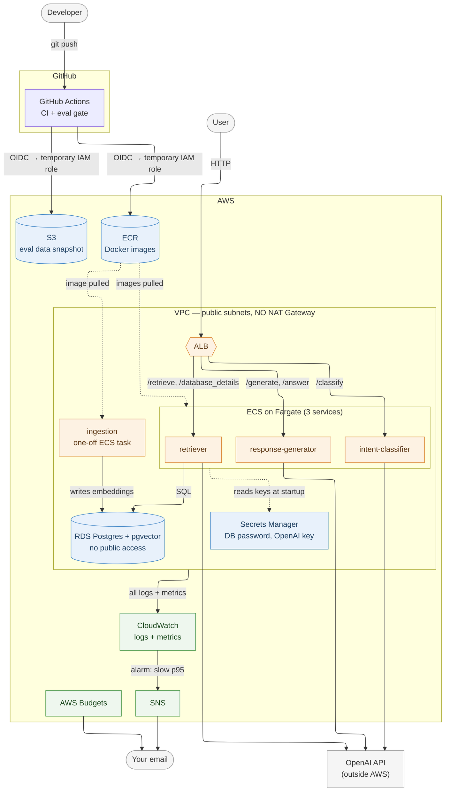

## AWS Infra

3 FastAPI services (intent classifier, retriever, response generator), a pgvector database, a one-off ingestion job, and GitHub Actions CI with an eval gate.

```mermaid
---
config:
  layout: elk
---
flowchart TB
    dev(["Developer"])
    user(["User"])
    email(["Your email"])
    openai["OpenAI API<br/>(outside AWS)"]

    subgraph GH["GitHub"]
        gha["GitHub Actions<br/>CI + eval gate"]
    end

    subgraph AWS["AWS"]
        ecr[("ECR<br/>Docker images")]
        s3[("S3<br/>eval data snapshot")]

        subgraph VPC["VPC — public subnets, NO NAT Gateway"]
            alb{{"ALB"}}

            subgraph ECS["ECS on Fargate (3 services)"]
                ic["intent-classifier"]
                ret["retriever"]
                rg["response-generator"]
            end

            ingest["ingestion<br/>one-off ECS task"]
            rds[("RDS Postgres + pgvector<br/>no public access")]
            sm["Secrets Manager<br/>DB password, OpenAI key"]
        end

        cw["CloudWatch<br/>logs + metrics"]
        sns["SNS"]
        budgets["AWS Budgets"]
    end

    dev -- "git push" --> gha
    gha -- "OIDC → temporary IAM role" --> ecr
    gha -- "OIDC → temporary IAM role" --> s3
    ecr -. "images pulled" .-> ECS
    ecr -. "image pulled" .-> ingest

    user -- "HTTP" --> alb
    alb -- "/classify" --> ic
    alb -- "/retrieve, /database_details" --> ret
    alb -- "/generate, /answer" --> rg

    ic --> openai
    ret --> openai
    rg --> openai

    ret -- "SQL" --> rds
    ingest -- "writes embeddings" --> rds
    ECS -. "reads keys at startup" .-> sm

    VPC -- "all logs + metrics" --> cw
    cw -- "alarm: slow p95" --> sns
    sns --> email
    budgets --> email

    classDef ext fill:#f5f5f5,stroke:#999,color:#333
    classDef data fill:#e8f1fb,stroke:#3b82c4,color:#1a3c5e
    classDef compute fill:#fdf2e3,stroke:#d9822b,color:#5a3410
    classDef ops fill:#eef7ee,stroke:#3f9142,color:#1d4a1f
    class dev,user,email,openai ext
    class ecr,s3,rds,sm data
    class ic,ret,rg,ingest,alb compute
    class cw,sns,budgets ops
```