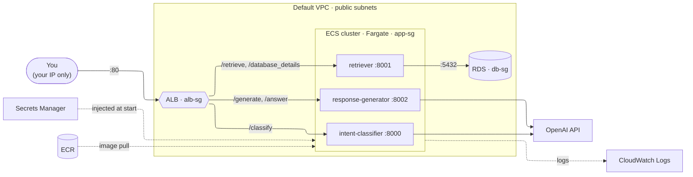

## AWS Infra

3 FastAPI services (intent classifier, retriever, response generator), a pgvector database, a one-off ingestion job, and GitHub Actions CI with an eval gate.


## ECS Services


## Costs: what to take care of

Approximate us-east-1 prices. Most things bill **by the hour while they exist**, whether or not anyone uses them.

| Resource | Billed while… | Approx. cost | Take care of it by… |
|---|---|---|---|
| **ALB** | it **exists**, even with zero traffic | ~$0.03/hr (~$22/month) | Deleting it for breaks longer than a day or two. Target groups survive, so only the ALB, listener and rules need recreating. |
| **ECS tasks** (3 services) | running | ~$0.04/hr total on Fargate Spot | Scaling services to `--desired-count 0` at the end of each session |
| **RDS** (`db.t4g.micro`) | running (instance) / always (storage) | ~$0.016/hr + ~$2.30/month | Stopping it after each session. ⚠️ AWS **restarts a stopped DB after 7 days**, so check weekly. |
| **Ingestion task** | running (a few minutes per run) | cents per run | Nothing: it stops by itself |
| **Secrets Manager** (2 secrets) | always | ~$0.80/month | Nothing |
| **ECR** images | always (storage) | ~$1/month | Lifecycle policy keeps only the last 3 images per repo |
| **S3**, **CloudWatch Logs** | always (storage) | cents | Log retention is set to 7 days |
| ECS cluster, task definitions, target groups, security groups, IAM roles, OIDC providers | — | **free** | Nothing |
| **NAT gateway** | it exists | ~$33/month | **Never create one.** Tasks use public IPs locked down by security groups instead. |
| **OpenAI API** | per request (billed by OpenAI, not AWS) | cents at learning volumes | Keeping the ALB restricted to your IP (`alb-sg`), so strangers can't run up your OpenAI bill |

**Start/stop order:** start RDS **before** scaling services up (the retriever fails its health checks without the database); scale services to 0 **before** deleting the ALB.

**Safety net:** the AWS Budgets alerts ($5 actual, $20 actual, $20 forecast) email you if spending runs away. They only warn; they don't stop anything.

## Session scripts

The start/stop routine above is scripted in [`aws/scripts/`](aws/scripts/) (PowerShell). Run them from the repo root after `aws login --profile auto-safety`:

| Script | When | What it does |
|---|---|---|
| [`session-start.ps1`](aws/scripts/session-start.ps1) | Start of a session | Starts RDS and waits → recreates the ALB if it was deleted (otherwise updates its allowed IP to your current one) → scales services to 1 → waits until stable → prints target health and the app URL |
| [`session-stop.ps1`](aws/scripts/session-stop.ps1) | End of a session | Scales services to 0 → stops RDS. Leaves the ALB. |
| [`alb-down.ps1`](aws/scripts/alb-down.ps1) | Breaks longer than a day or two | Scales services to 0 → deletes the ALB (its listener and rules go with it; target groups stay) |
| [`alb-up.ps1`](aws/scripts/alb-up.ps1) | Called by `session-start.ps1`, or by hand | Recreates the ALB, the HTTP listener and the three path rules. Does nothing if the ALB exists. |
| [`_common.ps1`](aws/scripts/_common.ps1) | — | Shared resource names, routes and helpers loaded by the other scripts |

```powershell
.\infra\aws\scripts\session-stop.ps1     # end of session
.\infra\aws\scripts\alb-down.ps1         # also, for longer breaks
.\infra\aws\scripts\session-start.ps1    # next session
```

If Windows refuses with "running scripts is disabled", run `Set-ExecutionPolicy -Scope CurrentUser RemoteSigned` once.

## Folder layout

| Folder | Contents |
|---|---|
| [`aws/iam/`](aws/iam/) | Trust and permissions policies for the IAM roles: eval CI (S3 read), ECR push (CI) and ECS task execution |
| [`aws/ecr/`](aws/ecr/) | ECR lifecycle policy (keep the last 3 images) |
| [`aws/ecs/`](aws/ecs/) | ECS task definitions for the three services and the ingestion job |
| [`aws/scripts/`](aws/scripts/) | Session start/stop and ALB up/down scripts |

These files and scripts are the record of how the AWS setup is built. They'll be replaced by Terraform (RR-020).